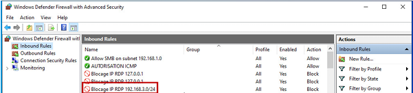
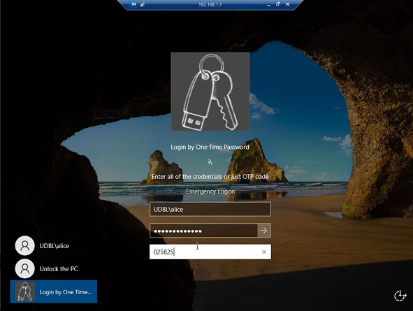

#  RDP Security Hardening System

##  Overview
This project focuses on improving the security of Windows Remote Desktop Protocol (RDP) by implementing automated detection, prevention mechanisms, and multi-factor authentication.

It was developed as a final-year academic project in Systems and Networks Administration.

---

##  Objectives
- Detect brute-force attacks on RDP services
- Automatically block malicious IP addresses
- Enhance authentication security using 2FA (TOTP)
- Send real-time security alerts to the administrator
- Implement contextual access control (time-based rules)

---

##  System Architecture
The solution is based on Windows Server and security automation scripts.

### Components:
- Windows Server (RDP Host)
- Windows Event Logs Monitoring
- PowerShell Automation Scripts
- Windows Firewall (IP Blocking)
- Telegram Bot API (Alerts)
- TOTP Authentication System

---

##  Key Features

-  Detection of multiple failed login attempts
-  Automatic IP blocking via firewall rules
-  Real-time Telegram notifications
-  Two-Factor Authentication (2FA / TOTP)
-  Time-based access control
- Security event logging and monitoring

---

## Technologies Used

- Windows Server
- Remote Desktop Protocol (RDP)
- PowerShell
- Windows Event Viewer
- Windows Defender Firewall
- Telegram Bot API
- TOTP Authentication

---

##  Workflow

1. System monitors Windows Security logs
2. Detects suspicious login attempts
3. Executes PowerShell automation script
4. Blocks malicious IP address automatically
5. Sends alert via Telegram
6. Applies security rules (2FA / access control)

---

##  Screenshots

### Topology (2FA)
Two-Factor Authentication (TOTP) verification during RDP login.

---

###  Firewall Blocked IPs
Automatically blocked malicious IP addresses via Windows Firewall rules.

### 📲 Telegram Alerts
Real-time security notifications sent to the administrator.

---

### 🔐 Authentication Process (2FA)
Two-Factor Authentication (TOTP) verification during RDP login.

---

##  Documentation

Full report available in `/docs/project_report.pdf`

---

##  Author
**Butseme Gloire**  
Systems & Networks Administration Graduate  
